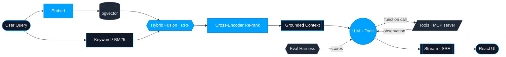

<!-- ╔══════════════════════════════════════════════════════════════════════╗ -->
<!-- ║                          T H A R U N . a g e n t                       ║ -->
<!-- ║          README rendered as an AI agent's system definition            ║ -->
<!-- ╚══════════════════════════════════════════════════════════════════════╝ -->

<p align="center">
  
</p>

<p align="center">
  
</p>

<p align="center">
  <a href="https://www.linkedin.com/in/tharun-guduguntla"></a>
  <a href="mailto:gtharun2511@gmail.com"></a>
  <a href="https://github.com/tharun2511"></a>
  
  
</p>

---

### `> system_prompt`

```python
agent = Engineer(
    name        = "Tharun Guduguntla",
    role        = "Full Stack & AI Engineer",
    experience  = "2+ years shipping scalable web & full-stack systems",
    now         = "building production LLM features from first principles",
    superpower  = "turning fuzzy LLM ideas into reliable, evaluated systems",
)

agent.system_prompt = """
You are Tharun. You design front-to-back: clean React/Next.js UIs, typed
Node/NestJS services, and Postgres data layers — then you make them think.
You don't bolt an API onto a product and call it 'AI'. You build retrieval,
tools, and evals from the ground up, because you've seen what breaks without them.
Default to shipping. Measure before you trust. Keep learning, relentlessly.
"""
```

---

### `> render: how_i_build_llm_features()`

> Not a stock diagram — this is the retrieval + agentic pipeline I actually wire up.



---

### `> agent.tools` — what I expose to the world

<table>
<tr>
<td width="50%" valign="top">

#### 🤖 `ai_engineering`
```jsonc
{
  "rag":        "embeddings + pgvector",
  "retrieval":  "hybrid search · RRF · re-rank",
  "agents":     "function-calling · ReAct loops",
  "protocol":   "MCP server (from scratch)",
  "orchestration": "LangChain · LangGraph",
  "quality":    "eval harnesses · prompt eng",
  "streaming":  "token-by-token over SSE",
  "models":     "Groq · Gemini · Llama 3.3"
}
```

</td>
<td width="50%" valign="top">

#### 🧱 `full_stack`
```jsonc
{
  "frontend":  "React · Next.js · Redux · Tailwind",
  "backend":   "Node.js · NestJS · Express",
  "api":       "REST · GraphQL · microservices",
  "data":      "PostgreSQL · MongoDB",
  "realtime":  "WebSockets · maps · live dashboards",
  "cloud":     "AWS · Docker · Linux",
  "lang":      "TypeScript · JavaScript · Python · Java",
  "roots":     "DSA · OOP · system design"
}
```

</td>
</tr>
</table>

---

### `> stack.index` — the retrieval index behind those tools

<p align="center">
  
  
  
  
  <br/>
  
  
  
  
  <br/>
  
  
  
  
  <br/>
  
  
  
  
  
</p>

---

### `> agent.query(topic)` — expand a context window

<details>
<summary><b>🔎 "How do you stop a RAG app from hallucinating?"</b></summary>

<br/>

Retrieval quality first — garbage context guarantees garbage answers. I run
**hybrid search** (semantic over pgvector + keyword/BM25), fuse with **RRF**, then
**cross-encoder re-rank** the top candidates so the model only sees the strongest
evidence. Then I make the model *cite* what it used, and I wrap the whole thing in an
**eval harness** so "it feels better" becomes a number I can defend.

</details>

<details>
<summary><b>🤖 "What's the hardest part of building an agent?"</b></summary>

<br/>

Not the function calling — it's the **loop**. Deciding when to call a tool, feeding
observations back cleanly, knowing when to stop, and handling the model going off the
rails. That's why I went deep on **LangGraph** (StateGraph, persistence, human-in-the-loop)
and built an **MCP server from scratch** — to actually understand the contract between
model and tools instead of trusting a black box.

</details>

<details>
<summary><b>🧱 "Are you AI or full-stack?"</b></summary>

<br/>

Both — and that's the point. The hard part of production AI isn't the prompt; it's the
**system around it**: the typed API, the streaming UI, the data layer, the failure modes.
2+ years of shipping React/Next.js + Node/NestJS means I can take an LLM feature from
idea to a thing real users can rely on — UI to vector store and back.

</details>

---

### `> metrics.dashboard`

<p align="center">
  
  
</p>

<p align="center">
  
</p>

<p align="center">
  
</p>

<!-- SNAKE: requires the Platane/snk GitHub Action committing to an `output` branch.
     Workflow file: .github/workflows/snake.yml  (setup steps at the bottom of this README) -->
<p align="center">
  
</p>

<p align="center">
  
</p>

---

### `> agent.status`

```diff
+ Open to:   Full Stack & AI Engineering roles · LLM product collaboration
+ Building:  RAG + agentic systems, eval-driven, shipped end to end
! Mindset:   build from first principles · measure before you trust
```

<p align="center">
  <a href="mailto:gtharun2511@gmail.com"></a>
  <a href="https://www.linkedin.com/in/tharun-guduguntla"></a>
</p>

<p align="center">
  <sub><code>// end of context window — always building, always learning. ⭐</code></sub>
</p>

<!-- ════════════════════════ SNAKE SETUP (delete this comment after) ═════════════════════════
Create .github/workflows/snake.yml in the tharun2511/tharun2511 repo:

name: Generate Snake
on:
  schedule: [{ cron: "0 */12 * * *" }]
  workflow_dispatch:
  push: { branches: [main] }
jobs:
  generate:
    runs-on: ubuntu-latest
    permissions: { contents: write }
    steps:
      - uses: Platane/snk/svg-only@v3
        with:
          github_user_name: tharun2511
          outputs: |
            dist/github-contribution-grid-snake-dark.svg?palette=github-dark
      - uses: crazy-max/ghaction-github-pages@v4
        with: { target_branch: output, build_dir: dist }
        env: { GITHUB_TOKEN: ${{ secrets.GITHUB_TOKEN }} }
═══════════════════════════════════════════════════════════════════════════════════════════ -->
