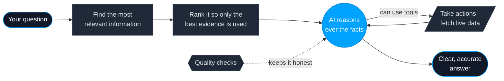

<!-- ╔══════════════════════════════════════════════════════════════════════╗ -->
<!-- ║              Tharun Guduguntla — GitHub profile README                  ║ -->
<!-- ╚══════════════════════════════════════════════════════════════════════╝ -->

  

<h1 align="center">Hi, I'm Tharun 👋</h1>

  <b>Full Stack & AI Engineer</b> · Hyderabad, India 🇮🇳 
  I build web apps people rely on — and now I make them <i>intelligent</i>.

  

  
  
  
  

---

## 👋 About Me

I'm a **software engineer with 2+ years of experience** building fast, scalable web and
full-stack applications with **React, Next.js, Node.js and NestJS**.

These days I'm focused on **AI engineering** — building real, production-grade features
powered by large language models (the technology behind tools like ChatGPT). I don't just
plug into an API and call it "AI"; I build the systems that make AI accurate, useful, and
reliable for actual users.

> 🎯 **In one line:** I take an idea, design it end-to-end — from the screen people see to
> the AI and data behind it — and ship something dependable.

---

## 💡 What I Do

<table>
<tr>
<td width="50%" valign="top">

### 🧱 Full-Stack Development
Building complete web products — the parts users see and everything powering them behind the scenes.

- Clean, intuitive **user interfaces** (React, Next.js)
- Fast, reliable **back-end services & APIs** (Node.js, NestJS)
- **Databases** & real-time features (live dashboards, maps, chat)
- Designed to **scale** and stay maintainable

</td>
<td width="50%" valign="top">

### 🤖 AI / LLM Engineering
Making products *intelligent* — so they can understand, reason, and answer.

- **AI that searches your own data** and answers accurately (RAG)
- **AI assistants & agents** that can take actions, not just chat
- **Smarter search** that understands meaning, not just keywords
- **Quality testing** so the AI stays trustworthy in production

</td>
</tr>
</table>

---

## 🛠️ Tech & Tools

  
  
  
  

  
  
  
  

  
  
  
  

  
  
  
  
  

---

## 🧩 How I Build an AI Feature

<i>A simple look at how I make AI give accurate, trustworthy answers — step by step.</i>

<b>🔧 The technical version (for fellow engineers)</b>

 

Retrieval-augmented generation done properly: **hybrid search** (semantic embeddings on
**pgvector** + keyword/BM25), fused with **Reciprocal Rank Fusion**, then **cross-encoder
re-ranking** so the model only sees the strongest evidence. On top: **function-calling
agents** and a **from-scratch MCP server**, orchestrated with **LangChain / LangGraph**
(StateGraph, persistence, human-in-the-loop), responses **streamed over SSE**, and the whole
thing wrapped in an **eval harness** so quality is a number, not a vibe.
Models: Groq · Gemini · Llama 3.3.

---

## 📊 My GitHub Activity

  
  

  

  

<!-- SNAKE: needs the Platane/snk GitHub Action (setup at the very bottom of this file). -->

  

---

## 🌱 Currently

- 🤖 Going deeper on **AI agents** that can reason and take actions
- 🧠 **AI-powered search & assistants** built on your own data
- 🏗️ **Next.js + system design** for products that scale
- 📚 Always learning — building from first principles, not shortcuts

---

## 🤝 Let's Connect

  I'm open to <b>Full Stack & AI Engineering</b> roles and collaborating on AI-powered products. 
  The fastest way to reach me 👇

  
  

  ⭐ Always building, always learning.

<!-- ════════════════════════ SNAKE SETUP (delete this comment after) ═════════════════════════
Create .github/workflows/snake.yml in the tharun2511/tharun2511 repo:

name: Generate Snake
on:
  schedule: [{ cron: "0 */12 * * *" }]
  workflow_dispatch:
  push: { branches: [main] }
jobs:
  generate:
    runs-on: ubuntu-latest
    permissions: { contents: write }
    steps:
      - uses: Platane/snk/svg-only@v3
        with:
          github_user_name: tharun2511
          outputs: |
            dist/github-contribution-grid-snake-dark.svg?palette=github-dark
      - uses: crazy-max/ghaction-github-pages@v4
        with: { target_branch: output, build_dir: dist }
        env: { GITHUB_TOKEN: ${{ secrets.GITHUB_TOKEN }} }
═══════════════════════════════════════════════════════════════════════════════════════════ -->
